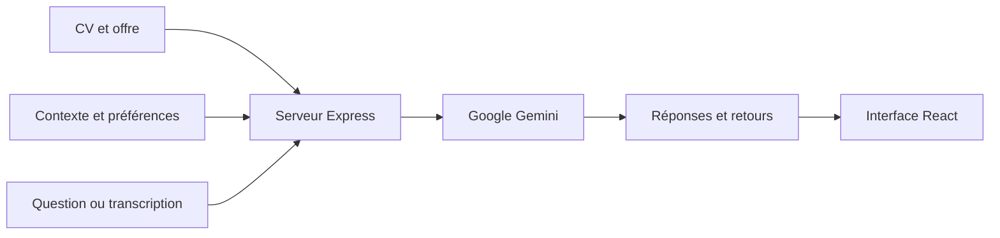

<div align="center">

# Interview Copilot

### Un assistant pour aider les étudiants à préparer leurs entretiens

Préparer ses réponses · Valoriser son parcours · S’entraîner avec l’IA


</div>

## Pourquoi ce projet ?

**Interview Copilot a été développé pour aider les étudiants à préparer leurs entretiens de stage, d’alternance et de premier emploi.** Quand on débute, il peut être difficile de présenter son parcours, de valoriser ses projets et de trouver des exemples concrets face aux questions d’un recruteur.

Le projet propose un accompagnement personnalisé à partir du CV, de l’offre visée et du contexte de l’entreprise. L’objectif est de rendre la préparation plus accessible, d’aider à structurer ses idées et de gagner en confiance grâce à la pratique.

Il s’agit d’un **premier jet, encore à améliorer**, qui associe une interface React, un serveur Node.js et l’IA générative de Google Gemini. Cette première version permet d’explorer le concept et de recueillir des retours ; elle doit encore être affinée et testée davantage pour améliorer la fiabilité, l’expérience utilisateur et la pertinence des conseils proposés aux étudiants.

## Ce que l’application permet de faire

| Fonctionnalité | Utilité pour l’étudiant |
| --- | --- |
| Import du CV et de l’offre | Préparer des réponses adaptées à son parcours et au poste, à partir de documents PDF, DOCX ou de texte. |
| Brief sur l’entreprise | Obtenir une synthèse générée par l’IA et des pistes de questions à poser au recruteur. |
| Questions d’entraînement | Générer des questions probables selon le poste et le contexte de l’entreprise. |
| Évaluation des réponses | Recevoir un score indicatif, des points forts, des axes d’amélioration et un exemple de réponse. |
| Suggestions contextualisées | Obtenir des propositions de réponses, des points clés et des mots-clés au fil de l’échange. |
| Reformulation | Demander une réponse plus courte, plus détaillée ou une autre formulation. |
| Transcription audio | Transcrire la parole via le navigateur, avec un mode de capture audio pour les échanges en visioconférence. |
| Préférences | Adapter la langue, le ton et l’affichage des suggestions. |

## Exemple de parcours

1. **Préparer son contexte** : importer son CV et une offre de stage ou d’alternance.
2. **Configurer la session** : calibrer sa voix, renseigner l’entreprise et choisir ses préférences.
3. **S’entraîner** : générer des questions et répondre avec ses propres mots.
4. **Progresser** : consulter les retours, identifier les exemples à développer et reformuler sa réponse.
5. **Recommencer** : travailler les questions difficiles pour être plus à l’aise le jour de l’entretien.

Par exemple, un étudiant qui prépare un entretien de développeur peut utiliser ses projets universitaires comme point de départ pour expliquer ses choix techniques, sa contribution dans une équipe et ce qu’il a appris.

## Fonctionnement technique

Le serveur extrait le texte des documents et conserve le contexte de la session en mémoire. Ce contexte est utilisé pour personnaliser les demandes envoyées à Gemini. Les réponses sont transmises progressivement à l’interface grâce aux **Server-Sent Events (SSE)**.



| Partie | Technologies |
| --- | --- |
| Interface | React 18, Vite, Tailwind CSS, Lucide |
| État de l’application | Zustand |
| Serveur et API | Node.js, Express |
| IA | Google Gemini, modèle `gemini-2.5-flash` configuré dans le code |
| Documents | Multer, pdf-parse, Mammoth |
| Audio | Web Speech API, Web Audio API, MediaRecorder |
| Réponses progressives | SSE |

Les fichiers et routes portant le nom `claude` sont des noms historiques : l’implémentation actuelle appelle Gemini.

## Installation locale

### Prérequis

- Node.js compatible avec Vite 5, par exemple Node.js 22, et npm.
- Une clé API Google Gemini, à créer dans [Google AI Studio](https://aistudio.google.com/apikey).
- Un navigateur proposant les API audio utilisées, comme Chrome ou Edge.

### 1. Récupérer le projet

```bash
git clone https://github.com/Ibrahim-bel/interview-copilot.git
cd interview-copilot
```

### 2. Configurer le serveur

```bash
cp .env.example backend/.env
```

Renseigner sa clé dans `backend/.env` :

```dotenv
GEMINI_API_KEY=votre_cle_api
PORT=3001
```

Le fichier `.env` est exclu du dépôt par `.gitignore`.

### 3. Installer et lancer

```bash
npm install
npm run install:all
npm run dev
```

- **Application** : http://localhost:5173
- **API** : http://localhost:3001
- **État du serveur** : http://localhost:3001/api/health

Pour générer la version de production de l’interface :

```bash
npm run build --prefix frontend
```

## Organisation du code

```text
interview-copilot/
├── backend/
│   ├── routes/              # Documents, réponses, brief et transcription
│   ├── services/            # Extraction, contexte de session et streaming
│   └── server.js            # Serveur Express
├── frontend/
│   └── src/
│       ├── components/
│       │   ├── Onboarding/  # Documents, voix, entreprise et préférences
│       │   ├── Dashboard/   # Transcription et suggestions
│       │   └── Training/    # Questions et évaluation des réponses
│       ├── hooks/           # Audio, streaming et raccourcis
│       ├── services/        # Appels API et traitement des réponses
│       └── store/           # État global de l’interface
├── .env.example
└── README.md
```

## Audio et raccourcis

La transcription au microphone nécessite l’autorisation du navigateur. Le mode de visioconférence demande une source de partage avec audio ; sa disponibilité dépend du navigateur, du système et de la source sélectionnée. Le prototype inclut aussi une calibration vocale expérimentale.

| Touche | Action |
| --- | --- |
| `Espace` | Mettre l’écoute en pause ou la reprendre |
| `R` | Demander une alternative |
| `C` | Raccourcir la réponse |
| `L` | Développer la réponse |
| `Échap` | Vider l’affichage |
| `Alt + H` | Masquer ou réafficher l’interface |

## État du prototype et limites

- Le contexte des sessions est conservé en mémoire : un redémarrage du serveur le réinitialise.
- La qualité de la transcription et la capture audio dépendent de l’environnement utilisé.
- Les réponses, les scores et les briefs sont générés par l’IA et peuvent comporter des erreurs. Le brief entreprise ne s’appuie pas sur une recherche web intégrée.
- Les fonctions d’IA nécessitent une clé valide et un accès au modèle configuré ; les quotas et les coûts dépendent du compte utilisé.
- Les extraits de CV, les questions et, dans le mode de transcription serveur, les segments audio sont transmis à Google Gemini pour traitement.
- Le serveur est prévu pour un usage local et ne dispose pas d’authentification pour un déploiement public.

## Intention pédagogique

Le projet est conçu comme un support d’apprentissage : apprendre à présenter ses expériences, construire des réponses personnelles et prendre du recul sur sa façon de communiquer. Les suggestions servent de base de travail pour développer ses propres réponses. Pour une utilisation pendant un entretien réel, convenir de l’usage de l’outil avec les participants.

## Contributions

Les idées et contributions sont les bienvenues, notamment pour améliorer l’expérience des étudiants, l’accessibilité, la transcription et les exercices d’entraînement. Une proposition peut être partagée dans les [issues du projet](https://github.com/Ibrahim-bel/interview-copilot/issues).
